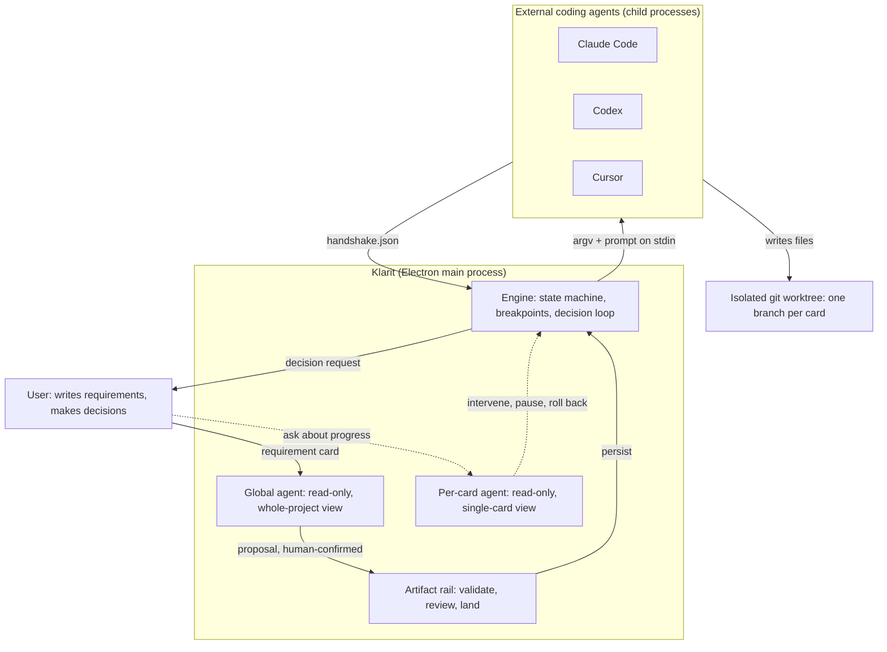
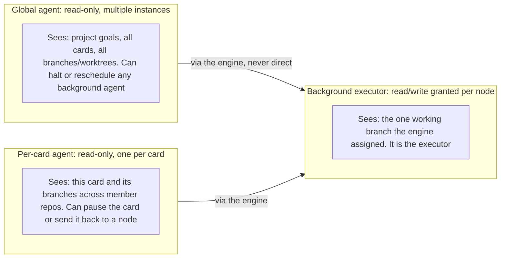
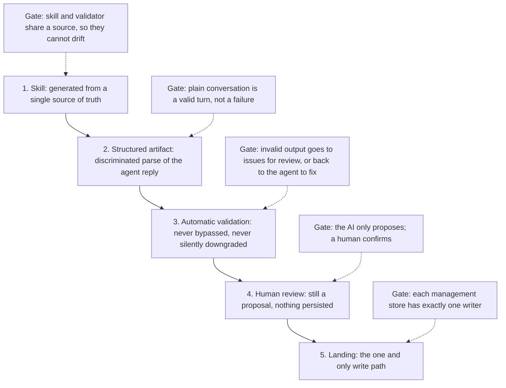
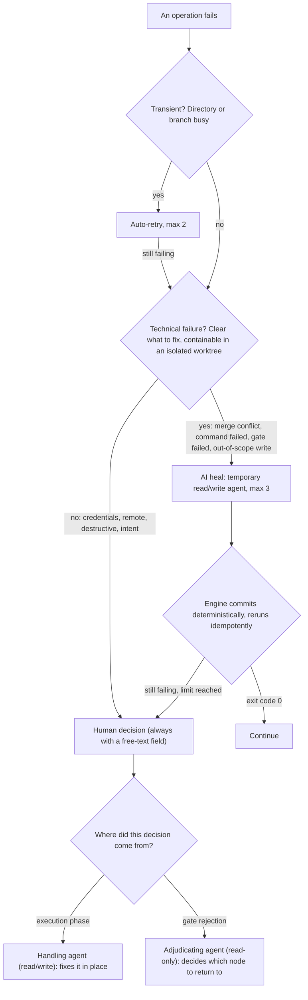
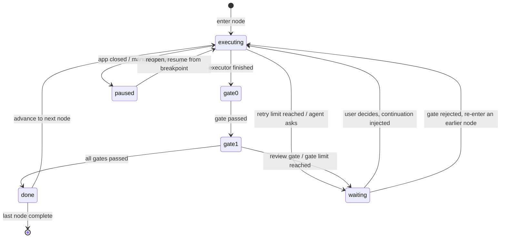

<div align="center">

# Klarit

**A harness for AI coding agents: requirements in, code out — orchestration, validation and failure recovery handled by the engine in between.**

[中文](./README.md) · [Core mechanisms](#core-mechanisms) · [Why it stopped](#why-development-stopped) · [Known limits](#known-limits)

</div>

> ⚠️ **This project is no longer under development.** The code stops at 2026-08-11. It is published not as a product pitch but as a complete record of one engineering approach to **agent orchestration and failure recovery** — the design docs, the specs, the tests, and the reasoning behind every mechanism are all in the repo. The reason it stopped is in [Why development stopped](#why-development-stopped).

---

## What this is

Klarit is a desktop **agent harness**. The user writes only requirement cards; the engine compiles each one into a stateful workflow and drives **external coding agent CLIs** (Claude Code / Codex / Cursor) node by node inside isolated git worktrees, validating every artifact and handling every failure along the way.

Klarit itself **writes no code and runs no model of its own** — writing code is the external agent's job. Klarit owns the layer above it: how context is assembled, how permissions are narrowed, how artifacts are validated, how failures self-heal, how a run resumes after a crash, and how specs keep a project from rotting under high-frequency AI edits.

Scale: roughly **31,300 lines** of implementation plus **25,100 lines** of tests (141 test files; tests-first was non-negotiable), **51** capability specs, and **58** archived change proposals.

---

## Core mechanisms



Six mechanisms, each linked to its design doc and code:

| Mechanism | In one line | Doc | Code |
|---|---|---|---|
| [Three agent tiers](#1-three-agent-tiers) | Tiered by "how much can it see, can it write", narrowing inward | [project-goals](./docs/project-goals.md) (zh) | `src/main/global-agent.ts`, `card-consult-service.ts`, `engine/engine.ts` |
| [Artifact rail](#2-the-artifact-rail-agent-skill-rail) | Every AI artifact rides one rail: skill → validate → review → land | [agent-skill-rail](./docs/agent-skill-rail.md) (zh) | `src/main/orchestrate-service.ts`, `orchestrate-producer.ts` |
| [Failure handling](#3-failure-handling-heal-and-content-driven-rollback) | Automatic first, AI self-heal next, bother the human last | [failure-handling](./docs/failure-handling.md) (zh) | `src/main/engine/decisions.ts`, `engine/engine.ts` |
| [Driving external agents](#4-driving-external-coding-agents) | Declarative adapters + handshake protocol + continuation ladder | [failure-handling §6](./docs/failure-handling.md) (zh) | `src/main/agent/adapter.ts`, `launch.ts`, `handshake.ts`, `continuation.ts` |
| [State and recovery](#5-state-and-recovery) | Breakpoint persisted at every phase boundary; resume where it stopped | [project-goals](./docs/project-goals.md) (zh) | `src/main/engine/run-store.ts`, `run-journal.ts`, `shared/types.ts` |
| [Spec-driven](#6-spec-driven-development-openspec) | Specs are the single source of truth; changes are proposals | `openspec/` | `openspec/specs/` (51), `openspec/changes/archive/` |

> The design docs are written in Chinese. This README summarises their content; the code and its inline documentation are the authoritative reference.

---

### 1. Three agent tiers

The AI inside Klarit is not one general-purpose blob. It is split into three tiers by **visibility** and **write permission**, narrowing from the outside in.



**How the boundaries were drawn:**

- **Only the innermost tier can write.** The global and per-card agents are read-only — the user consults them, makes decisions through them, sends work back through them, and no consultation can ever damage code. The only thing that touches files is a background executor the engine spawns on demand, with its writable scope confined to the assigned branch (out-of-scope detection below).
- **Visibility narrows tier by tier**: whole project → one card and its branch → one worktree. The closer to the code, the smaller the exposed surface.
- **Agents never talk to each other directly.** The engine is the only bus: a global agent that wants to intervene sends a control instruction to the engine, which then acts on the target process. Results cross between requirements through merged branches and card dependency edges, not through chatter. This constraint is what keeps "who changed what" traceable.

---

### 2. The artifact rail (agent-skill-rail)

This is an **architectural constraint** on the global agent: every capability it has for doing work on the user's behalf (orchestrating cards, decomposing requirements, authoring workflows, proposing a new project) rides the same rail rather than inventing its own artifact path. Adding a capability means adding a rider to the rail.



What each stage enforces:

1. **Skills are generated, not hand-written.** Anything that can be derived is derived from the data model — `buildDecomposeSkill(types)` from the card-type registry, `buildAuthorWorkflowSkill()` from the engine operation set and validation constraints. **A hand-written skill will eventually disagree with the validator**: the AI produces per the stale skill, the validator rejects per the new rules, and the symptom ("the AI keeps getting it wrong") hides a documentation-drift root cause.
2. **Structured artifacts**: the agent reply goes through a discriminated parser (`parseOpsReply`) that narrows it to a typed artifact — `ops`, a batch of candidate cards, a full workflow definition, or a natural-language reply. The agent self-routes within a single call, and pure conversation is a valid turn.
3. **Validation is never bypassed.** Everything passes the existing gates (`validateWorkflow`, `checkBranchPairing`, `validateCandidateBatch`, per-op `card-ops` checks). Invalid output is **never silently downgraded or treated as valid**: it either goes to issues for human review, or back to the agent to fix and re-report — partial work is not thrown away.
4. **Human review**: artifacts stop in proposal state (`OrchestrationProposal`), readable and editable in the UI, **never persisted before confirmation**.
5. **Landing**: after confirmation, each management store persists through its own path (`applyOps` for cards, `workflow-store.save()` for workflows) — **that path and no other**.

**Hard rules** every rider obeys: read-only, never touch code or git; propose only, land only after human confirmation; scoped to the current project; skills from a single source; validation never bypassed; self-routing within one call.

---

### 3. Failure handling (heal and content-driven rollback)

The design principle in one sentence: **no operation may ever come to rest in an invisible dead end with no way forward.** Every failure lands in one of four destinations, in the order **automatic → AI → human**.



**Three design trade-offs worth calling out:**

**1. Merge conflicts are resolved on the card branch, not on the mainline.**
A conflict means the card branch's changes and the mainline's changes hit the same place. The intuitive move is to let the AI resolve it on the mainline — but that puts an AI's hands on everyone's mainline, and cleaning up after a bad attempt is hard. Klarit inverts it: inside the worktree the card **already has in isolation**, run `git merge <mainline>`, keep the conflicted state rather than aborting, so the conflict surfaces on the card's side, and let the AI resolve it there. Once resolved, the card branch has absorbed the mainline, so **merging back is a clean fast-forward**. The mainline is never touched; if the AI makes a mess, the worst case is resetting the card branch to where it started. In multi-repo projects this runs per repo, independently.

**2. The heal agent edits but never commits; the engine commits and reruns to verify.**
Asking an AI whether it fixed the problem is unreliable — it will say yes. So the convergence criterion is an **objective fact**: the AI edits and exits without committing, the engine deterministically commits the in-scope changes, then **reruns the exact failing command or gate** and reads the exit code. "Fixed" is the result of an idempotent rerun, not a self-report.

**3. Gate rejection triggers content-driven rollback — and rollback means re-entry, not reset.**
When a human review gate is rejected, the target node is not specified up front; the user just writes "this doesn't feel right" in the free-text field. The engine spawns a **read-only** adjudicating agent to: parse the feedback → identify the artifacts it points at → use the **artifact lineage graph** to find the nodes that produced them → locate the **earliest** node covering all of them (primary plus alternatives) → hand the conclusion to the user for confirmation.

After rollback there is **no `git reset`, no reverting downstream code, no invalidating downstream artifacts**. The engine injects "you had already advanced to node N, here is the rejection feedback, fix it on top of current progress" into the target node's executor, and the workflow **flows forward again** through to the review gate. Branches and worktrees created along the way are reused by idempotent engine operations. The heavier model — "rollback = reset to the node's initial state and regenerate everything downstream" — was explicitly rejected.

**The lineage graph is a derived view, not a new store**: `deriveLineage(bp, git)` computes it from the run breakpoint on demand — declarative artifacts map to nodes by path, implicit artifacts like code map by each agent node's `git diff <startSha>..<commitSha>` change set. A separate store would be one more source of truth that can drift.

**When to give up**: two limits — 2 transient retries, 3 AI heal attempts. Past the limit nothing **silently hangs**; it becomes a **forward-only decision** with full context, where every option lets the flow continue (continue / skip / redo / try another way), destructive options are flagged, and **there is no "abort" dead-end option**. The fallback decision must also state "the AI already tried N times, and here is the actual error from the last attempt" — otherwise the user faces a failure with no context.

**Two built-in guardrails** (not failure handling as such, but what constrains agent edits):

- **Post-hoc out-of-scope detection.** Spawning a third-party CLI headlessly gives no way to sandbox its writes path by path, so detection happens **when the node completes**: compare the git change set against the effective writable scope (`declared scope ∪ all artifact paths`), **deterministically restore** out-of-scope files to the node's starting baseline, and keep in-scope changes. Details are fed back for a redo; past the limit a decision is raised whose options **must include "widen the writable scope"** (out-of-scope writes usually mean the scope was declared too narrowly, and without that option the loop never terminates). See `src/main/agent/scope.ts`.
- **Per-node commit.** After restoration, the engine commits the in-scope changes and records the SHA — which serves both as the lineage anchor for implicit code artifacts and as the starting baseline for the next node's scope check.

---

### 4. Driving external coding agents

Klarit runs no model of its own; it reuses the coding CLI subscription the user already has. Three decisions govern how those are driven:

```mermaid
sequenceDiagram
    participant E as Engine
    participant A as adapter (pure function)
    participant L as launch (single spawn path)
    participant CLI as External agent process
    participant W as worktree

    E->>A: Declarative: tool, model, effort, extraArgs, extraDirs
    A-->>E: argv array (prompt never in argv)
    E->>L: spawn(toolId, argv, cwd=worktree)
    Note over L: Launch by resolved absolute executable path; argv never string-joined through a shell; environment sanitised
    L->>CLI: Start process, full prompt via stdin
    CLI->>W: Writes code and artifact files
    CLI->>CLI: Writes handshake.json (outside the worktree)
    CLI-->>E: Process exits
    E->>E: Read handshake, status: done / need-decision / failed
    E->>W: Scope check, restore, commit, record SHA
```

**1. Declarative adapters, never raw launch commands.**
Workflows are data meant to be shared and reused; a raw command hard-codes one machine's CLI path and environment into the workflow. So a node declares only `{tool id, model, extra args}`, and an adapter — **a pure function that does nothing but translate argv** — turns that into an actual invocation. Raw commands survive only as an advanced escape hatch. Three adapters shipped: `claude -p`, `codex exec`, `cursor-agent -p`. See `src/main/agent/adapter.ts`.

**2. Context arrives on stdin, and the prompt is deterministically assembled.**
The full prompt goes over stdin rather than argv, avoiding length limits, escaping, and injection at once. A pure function assembles it in a **fixed layer order**: reply language → constitution → task → requirement card → member repos involved → writable scope → artifacts → engine interaction protocol. The same function serves both execution and the UI's "preview the full prompt" — the difference comes from the input (preview uses placeholder slots), never from different assembly rules. See `src/shared/agent-prompt.ts`.

**3. Success is judged from a handshake file, not by parsing stdout.**
Stdout exists only to show live progress to the user. The **single source of truth** for structured control state is the `handshake.json` the agent writes to an engine-specified absolute path (`status: done / need-decision / failed`, carrying a full decision structure when it needs one). The handshake **must live outside the worktree**, or the scope check and the per-node commit would sweep it into the user's repository.

**A missing handshake is optimistically treated as `done`** — third-party CLIs will not follow a protocol perfectly, and rather than deadlock here, the objective gates and the scope check are left to catch genuine incompleteness and trigger a heal. This is a deliberate point of tolerance: protocol strictness is bought with downstream verification, not with an upstream compliance assumption.

**Security boundary** (`src/main/agent/launch.ts` is the **only** spawn implementation; every call site goes through it):

- **Launch by the resolved absolute executable path**, never by handing a bare command name to a shell. The child process's cwd is a requirement card's worktree whose contents may come from an imported third-party project — and Windows command resolution **searches the current directory first**, so passing a bare name would let the managed repository decide which executable runs.
- **argv is never string-joined through a shell.** `.exe` is spawned directly; when a `.cmd` or `.bat` must go through cmd.exe, we quote each item ourselves — Node's `shell: true` joins command and args with spaces and no quoting, which is precisely the injection surface.
- If no trustworthy absolute path resolves, it is a technical failure — **never a fallback to the bare name**. Launching something of uncertain identity is worse than not launching.

---

### 5. State and recovery

One execution is a **run**, identified by a `runId`. All of its state lives in a **breakpoint** persisted to `userData/engine-runs/<runId>.json`.



What the breakpoint records (`RunBreakpoint`, see `src/shared/types.ts`): current node and phase; the **furthest node reached** (preserved, not overwritten, when rolling back to an earlier node, so a continuation can tell the agent how far it had already got); the pending decision and **when it was raised**; per-artifact completion state; the **gate retry log** (persisted so counters survive a restart); **restartable records** for background commands; per-member-repo derived context; and the commit SHAs of implicit code artifacts.

**Recovery rule**: the engine writes the breakpoint at **every phase boundary**. On resume — if artifacts are incomplete, rerun the executor; if artifacts are complete but gates are not, continue from the next gate. Closing the app pauses every in-flight card; reopening resumes them.

**Agent-side recovery uses a best-effort-first ladder** (`src/main/agent/continuation.ts` — one decision point covering heal feedback, decision replies, and crash recovery alike):

1. **Native continuation** (`claude --continue`, `codex exec resume`, `cursor-agent --resume`) — reconnects to the agent's own on-disk session, the highest fidelity, and the only thing that covers a crash mid-task. Only a delta needs injecting.
2. **Self-stored rebuild** — when no session id is available or the resume fails to launch, start fresh with "full task prompt + tail of our own transcript + delta".
3. **Coarsest fallback** — an empty delta, which is simply rerunning the node.

**Worktree files always underpin all three**: whichever rung is taken, the agent can read the real changes already on disk, so the worst case is repeating some work, not starting from zero.

**Traces for debugging**: an AI is a black box, so every agent run — node agents, heal continuations, merge heals, command heals — gets its own persisted record containing at minimum the **full prompt** it was given, the transcript written as it ran, the handshake contents and final status, the final destination, the owning run/node/member repo with per-repo start and end SHAs, and which heal attempt this was. The UI shows the prompt next to the live output — **including for temporary heal agents**, because a temporary agent must not be a black box either.

---

### 6. Spec-driven development (OpenSpec)

This is the anti-rot layer. The constraint is simple:

- **`openspec/specs/` is the single source of truth** — 51 capability specs, each written as `Requirement` plus `Scenario` (WHEN/THEN), not as prose.
- **`openspec/changes/` holds change proposals** — each with `proposal.md` (why), `design.md` (how, and what was rejected), `tasks.md` (checkable, one line at a time), and a **delta** under `specs/` (which requirements this change adds, removes or edits). When it is done it is archived into `changes/archive/` and the delta is merged into the main specs. The repo holds **58** archived changes.
- **Living documents record only the current state**: no old versions, no diffs against old versions. If it is stale, edit it or delete it.

**Why this prevents rot**: when AI is editing code at high frequency, rot does not usually start in the code — it starts when what the docs say and what the code does diverge. Once that happens, the next AI pass edits against a stale doc, and errors compound. So the order is fixed as **spec first → red test → implementation**, never implementation followed by documentation. Every Scenario maps to a test case, which makes staleness *detectable*: if the spec and the tests disagree, the suite is red.

The same reasoning applies to skills (see the artifact rail, point 1): if it can be generated from the data model, generate it, and never keep a second source of truth that can drift.

---

## Tech stack

| Layer | Choice |
|---|---|
| Shell | Electron 42 + electron-vite 5 |
| UI | React 19 · Tailwind v4 (semantic tokens, light/dark) · zustand · i18next (zh/en) |
| Editor / views | monaco · react-markdown |
| Main process | Node child-process orchestration (headless CLIs, not PTY) · chokidar · yaml |
| Tests | Vitest 4 (happy-dom + @testing-library/react) · Playwright (e2e) |
| Tooling | TypeScript 6 (separate node/web configs) · commitlint + husky (Conventional Commits) |
| Specs | OpenSpec (`specs/` as source of truth + `changes/` proposals) |

---

## Running and building locally

Prerequisites: Node 20+, Git. To actually execute a workflow you also need at least one agent CLI installed (Claude Code / Codex / Cursor); Klarit scans for it at startup and resolves its absolute executable path. Without one the app still runs, but agent nodes will report a technical failure.

```bash
npm install

npm run dev            # development mode (hot reload)
npm run build          # build main / preload / renderer
npm start              # preview the built output (does not watch sources)

npm run typecheck      # tsc, both configs
npm run test:run       # vitest, full suite once (141 test files)
npm run test:coverage  # with coverage
npm run test:e2e       # builds first, then playwright
npm run package        # build + electron-builder
```

A single test: `npx vitest run path/to/file.test.ts` or `npx vitest run -t "name fragment"`.

> **Note**: when using Klarit to manage Klarit itself (dogfooding), use `npm start`, not `npm run dev` — `dev` watches sources, so every edit an agent makes triggers a hot reload that collides with the running workflow.

---

## Why development stopped

Midway through development I found a mature competitor that had already built out the **execution layer** — agent orchestration and concurrent execution — to a fairly complete degree. After comparing them, the conclusion was:

- **Competing head-on at the execution layer was not winnable.** Their investment and completeness at that layer far exceeded what a one-person project could match. My differentiation could only be at the **requirements layer** — decomposing and merging requirements, the card relationship graph, spec-driven anti-rot. But the requirements layer alone is not a product; it has to sit on an execution layer that is good enough.
- **Their licence forbids commercial embedding**, and their code cannot be borrowed from. So the cheapest path — build the requirements layer on top of theirs — was closed, leaving only "build an execution layer of equivalent completeness myself", which is an investment I was not going to make.
- So the decision was to **cut losses** rather than grind on.

This was a product validation with a clear conclusion: **the hypothesis was falsified, so it stopped**. The technical questions worth answering had been answered — the three-tier permission model works, the heal mechanism genuinely converges on real merge conflicts and real test failures, and breakpoint recovery does pick up after the app is closed and reopened. The product conclusion was that this does not add up to a standalone product worth continuing to fund.

What remains is this repository: a complete agent harness design, along with a record of what the alternative was for each decision and why it was rejected — all in `openspec/changes/*/design.md` and `docs/`.

---

## Known limits

Stated plainly, these are the parts **known to be unfinished or unvalidated**:

**Half-built by design:**

- **The `subworkflow` executor is defined but not implemented.** Of the four node executor kinds, `agent`, `engine` and `command` all landed; `subworkflow` (a workflow calling a workflow, with cycle detection, depth limit and I/O mapping) stops at the data model and is skipped at runtime.
- **Only Claude Code has been driven end to end.** The Codex and Cursor adapters are written (argv translation and continuation forms), but have not been run through a full workflow on a real project — particularly their continuation semantics and how faithfully they follow the handshake protocol.
- **The external gate supports only `pr-merged`**, and its recheck is triggered by the user pressing a button. The check was deliberately designed as "verify external state" rather than "trust the user's assertion" so a platform webhook could drive it later — but no webhook was wired up.
- **The lineage graph covers only agent code artifacts and declarative artifacts.** Implicit artifacts produced by command nodes are not in the graph, so content-driven rollback cannot locate a problem that originated in a command node.
- **Klarit's own skills are not installed into the user's CLI.** By design they should be invoked by name as installed skills (leaner prompts, visible and editable by the user); in practice they are still inlined into the prompt each turn. The fallback path is written; the primary path is not.

**Not validated at scale:**

- **Dogfooded only single-machine, single-user, on small projects.** Multi-repo was exercised with at most two member repos; nothing was validated with dozens of cards in flight or dozens of worktrees in one repo.
- **The concurrency limit is a guess.** Auto-scheduling and scheduled patrols share one concurrency budget, and when it is full the tick is skipped rather than queued — whether that is the right policy under real load is unmeasured.
- **The 3-attempt heal limit has no tuning basis.** It sufficed for the conflicts and test failures I hit, but I never collected the distribution of "which attempt converged", so I do not know whether 3 is conservative or aggressive.
- **Crash recovery was only exercised by killing processes manually.** Real crashes, half-written files, and worktrees mutated by external tools were never tested systematically.
- **Context assembly cost was never measured.** The `habit-context` optimisation — replacing "mount the whole member repo for the authoring agent" with a verbatim materialised context bundle — was done because authoring became unusably slow on large projects, but **the gain was never measured** afterwards. I know it works; I do not know how much faster it is.

---

## Documents

- [`docs/project-goals.md`](./docs/project-goals.md) — positioning, scope boundaries, the three agent tiers, the communication model, the workflow and node model, cards and their relationship graph (zh)
- [`docs/agent-skill-rail.md`](./docs/agent-skill-rail.md) — the global agent's artifact rail, its riders, the hard rules, and the recipe for adding a capability (zh)
- [`docs/failure-handling.md`](./docs/failure-handling.md) — the single reference for failure and decision handling, including every prompt fed to an AI, verbatim (zh)
- [`docs/article-draft.md`](./docs/article-draft.md) — article source material: how the harness was designed and why it stopped (zh)
- [`docs/brand/`](./docs/brand) — brand and UI conventions (light/dark, semantic tokens)
- `openspec/specs/` — 51 capability specs · `openspec/changes/archive/` — 58 archived change proposals
- [`CLAUDE.md`](./CLAUDE.md) — repository conventions for AI coding tools (zh)

---

## License

[Source-Available License](./LICENSE) — published for reading and evaluation; all rights reserved. Production or commercial use requires prior written permission.
