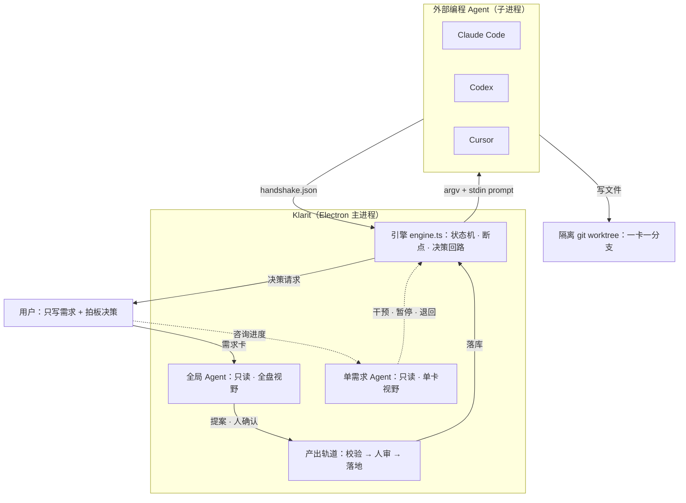
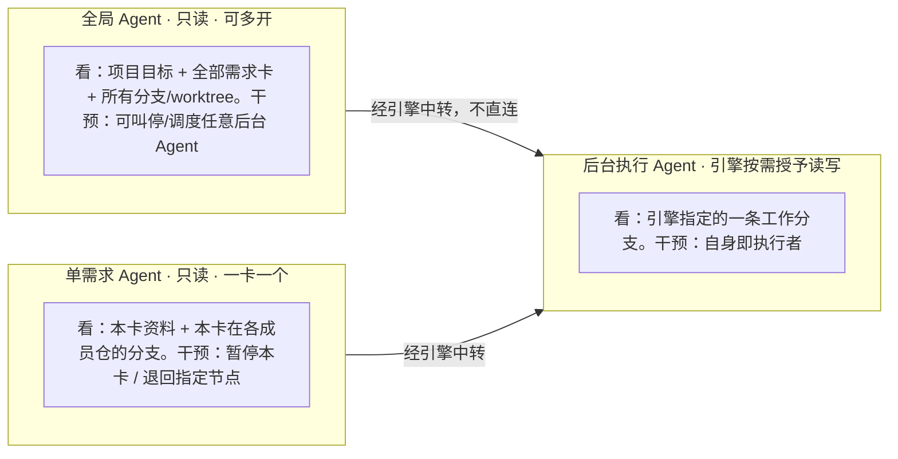
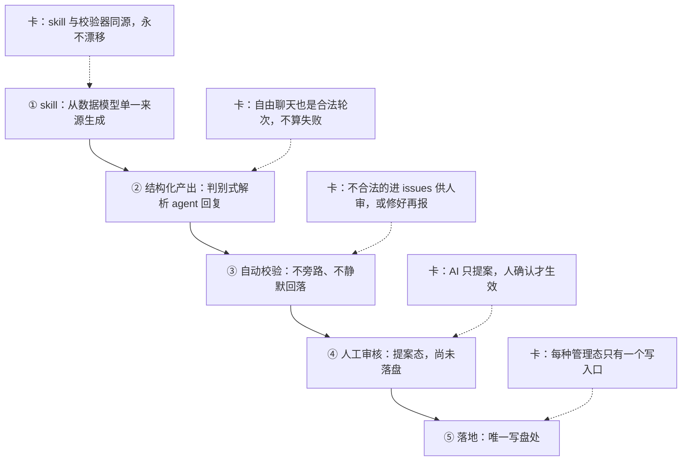
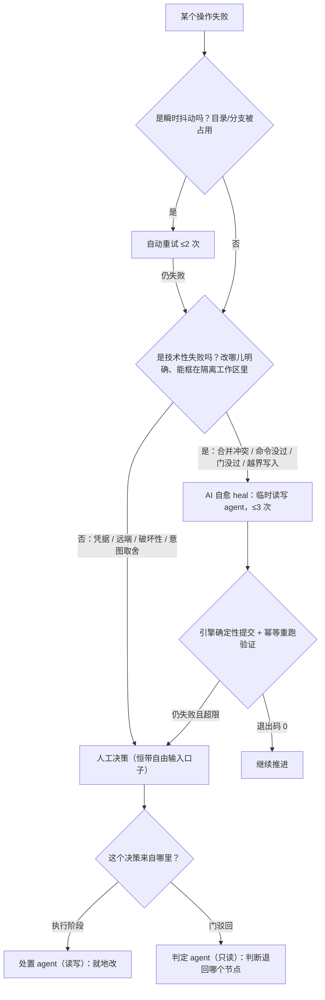
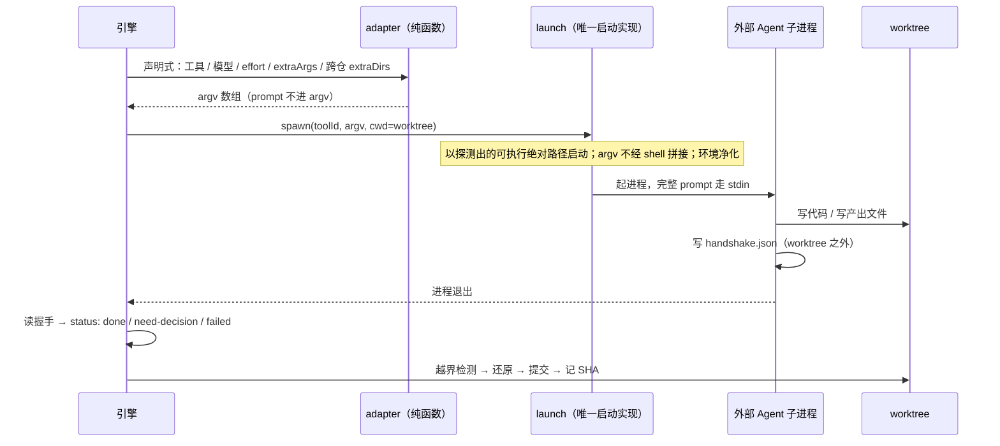
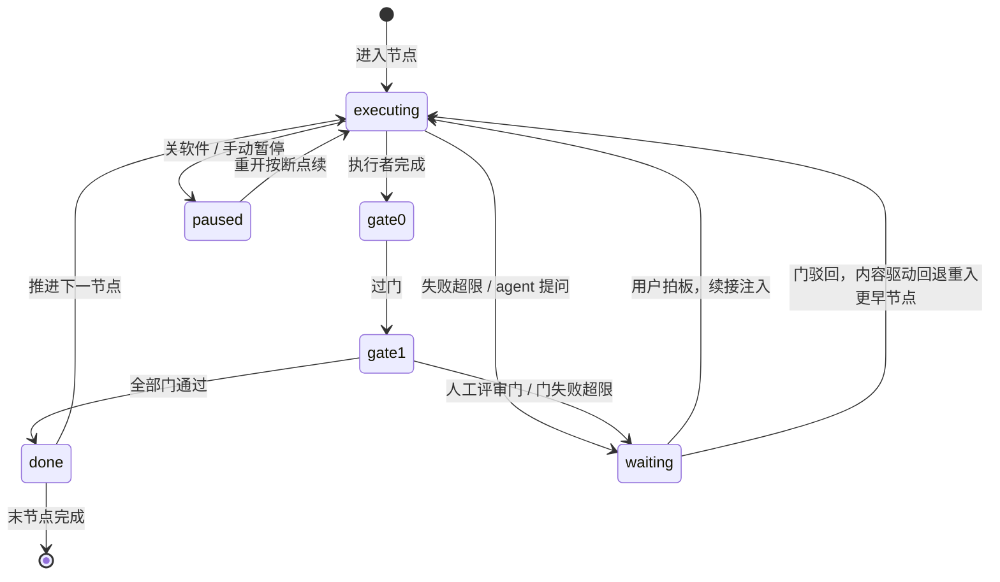

<div align="center">

# Klarit

**给 AI 编程工具套一层 Harness：需求进、代码出，中间的编排、校验、失败恢复由引擎负责。**

[English](./README.en.md) · [核心机制](#核心机制) · [为什么停止](#为什么停止投入) · [已知边界](#已知边界)

</div>

> ⚠️ **本项目已停止开发**，代码停在 2026-08-11。公开它不是在推产品，而是把一套 **Agent 编排与失败恢复**的工程实践完整留档：设计文档、规格、测试、以及每个机制「当时为什么这么选」都在仓库里。停止的原因写在[为什么停止投入](#为什么停止投入)。

---

## 这是什么

Klarit 是一个桌面端的 **Agent Harness**：用户只写需求卡，引擎把它编译成一条状态化工作流，逐节点驱动**外部编程 Agent CLI**（Claude Code / Codex / Cursor）在隔离的 git worktree 里干活，并对每一步的产出做校验、对每一次失败做处置。

它自己**不写代码、不自建模型通道**——写代码是外部 Agent 的事，Klarit 管的是它们上面那一层：上下文怎么装配、权限怎么收窄、产出怎么验、失败怎么自愈、进程崩了怎么接着跑、以及规格怎么防止项目在 AI 高频改动下腐烂。

规模：约 **31,300 行**实现代码 + **25,100 行**测试（141 个测试文件，测试先行不可妥协）、**51 份**能力规格、**58 个**已归档的变更提案。

---

## 核心机制



六个机制，每个都链到设计文档与代码：

| 机制 | 一句话 | 文档 | 代码 |
|---|---|---|---|
| [三层 Agent](#1-三层-agent-结构) | 按「能看多大范围、能不能写」分层，权限逐层收窄 | [project-goals](./docs/project-goals.md) | `src/main/global-agent.ts`、`card-consult-service.ts`、`engine/engine.ts` |
| [产出轨道](#2-产出轨道agent-skill-rail) | 所有 AI 产出走同一条 skill → 校验 → 人审 → 落地的轨道 | [agent-skill-rail](./docs/agent-skill-rail.md) | `src/main/orchestrate-service.ts`、`orchestrate-producer.ts` |
| [失败处置](#3-失败处置heal-与内容驱动回退) | 先自动、再 AI 自愈、最后才打扰人 | [failure-handling](./docs/failure-handling.md) | `src/main/engine/decisions.ts`、`engine/engine.ts` |
| [编排外部 Agent](#4-编排外部编程-agent) | 声明式 adapter + 握手文件协议 + 续接阶梯 | [failure-handling §6](./docs/failure-handling.md) | `src/main/agent/adapter.ts`、`launch.ts`、`handshake.ts`、`continuation.ts` |
| [状态与恢复](#5-状态与恢复) | 阶段边界持久化断点，关软件重开按断点续 | [project-goals](./docs/project-goals.md) | `src/main/engine/run-store.ts`、`run-journal.ts`、`shared/types.ts` |
| [规格驱动](#6-openspec-规格驱动) | specs 是单一真相源，changes 是变更提案 | `openspec/` | `openspec/specs/`（51 份）、`openspec/changes/archive/` |

---

### 1. 三层 Agent 结构

Klarit 里的 AI 不是一个大杂烩，而是按**可见范围**和**写权限**切成三层，从外到内收窄。



**边界怎么划的**：

- **只有最内层能写**。全局和单需求 Agent 是只读的——用户拿它咨询、拍板、退回任务，任何一次咨询都不可能误伤代码。真正动文件的只有引擎按需拉起的后台执行 Agent，且它的可写范围被限定在指定分支内（越界检测见下）。
- **可见范围逐层收窄**：全局看全盘 → 单需求看一卡一支 → 执行只看自己那条 worktree。越靠近代码，暴露面越小。
- **Agent 之间永不直连**。引擎是唯一总线：全局 Agent 想干预后台 Agent，是向引擎发控制指令、引擎再去操作目标进程；跨需求传递成果靠合并后的分支和卡片依赖边，不互相喊话。这条约束让「谁改了什么」始终可追。

> 三层的划分理由与通信模型：[`docs/project-goals.md`](./docs/project-goals.md) 的「三层 Agent 结构」「通信模型」两节。

---

### 2. 产出轨道（agent-skill-rail）

这是全局 Agent 的一条**架构约束**：它每一项「帮用户干活」的能力（编排需求卡、分解需求、写工作流、提议建项目）都骑在同一条轨道上，而不是各写一套产出逻辑。加新能力＝往轨道上加一个骑手。



每一环卡的东西：

1. **skill 从单一来源生成**。凡是能自动生成的 skill，就从数据模型生成——`buildDecomposeSkill(types)` 从卡类型注册表生成、`buildAuthorWorkflowSkill()` 从引擎操作集与校验约束生成。**手写一份 skill 文本，它迟早和校验器对不上**：AI 按老 skill 产出、校验器按新规则拒绝，症状是「AI 总是产不对」而根因在文档漂移。
2. **结构化产出**：agent 回复经判别式解析器（`parseOpsReply`）收敛成带类型的产出——`ops` / 候选卡批 / 完整工作流定义 / 自然语言回复。一次调用内 agent 自己路由到哪一种，纯聊天是有效轮次。
3. **校验不旁路**。产出一律过既有校验闸（`validateWorkflow`、`checkBranchPairing`、`validateCandidateBatch`、逐 op 的 `card-ops` 校验）。不合法的**不静默回落、不当合法用**：要么进 issues 让人审，要么让 agent 修好再报——半成品不丢。
4. **人工审核**：产出停在提案态（`OrchestrationProposal`），在 UI 里可读可改，**确认前不落盘**。
5. **落地**：人确认后经该管理态自己的存储写盘（`applyOps` 落卡库 / `workflow-store.save()` 存工作流），**只此一处**。

**红线**（每个骑手都得守）：只读、绝不碰代码与 git；只提案、人确认后才落地；限当前项目、不跨项目；skill 从单一来源来；校验不旁路；一次调用完成自路由。

> 完整轨道、骑手表、加新能力的配方：[`docs/agent-skill-rail.md`](./docs/agent-skill-rail.md)

---

### 3. 失败处置（heal 与内容驱动回退）

设计原则一句话：**任何操作结果都不许停在看不见、没有出路的死结**。每个失败必然落到四个归宿之一，顺序是**先自动、再 AI、最后才打扰人**。



**三个设计取舍值得单说：**

**① 合并冲突不在主线上解，反过来把主线并进卡分支。**
冲突的本质是「卡分支的改动」和「主线的改动」撞在同一处。直觉做法是在主线上叫 AI 解冲突——但那意味着 AI 在所有人的主线上动手，搞砸了很难干净回退。Klarit 反过来：在卡**本来就隔离**的 worktree 里 `git merge <主线>`、保留冲突态不 abort，让冲突显现在卡这边，AI 就地解；解完卡分支已经消化了主线，**再合回主线就是干净快进**。主线全程没被碰过，AI 搞砸了大不了把卡分支重置回动手前。多仓时逐仓各走一遍、各自独立。

**② heal agent 只改不提交，由引擎提交并重跑验证。**
让 AI 自己判断「我修好了吗」是不可靠的——它会说修好了。所以收敛判据是**客观事实**：AI 改完就退出（不提交），引擎确定性提交范围内改动，再把那条失败的命令 / 那道门**原样重跑一遍**，看退出码。这样「修好了」不是 AI 的自我报告，而是幂等重跑的结果。

**③ 门驳回走内容驱动回退，且回退是「重入」不是「重置」。**
人工评审门驳回时，不预先指定回退到哪个节点——用户只在自由输入框写「这里体验不对」。引擎拉起一个**只读**判定 agent，让它：解析反馈 → 命中的产物集合 → 经**产物溯源图**反查生产这些产物的节点 → 定位覆盖它们的**最早**节点（给主选 + 备选）→ 交用户确认。

回退之后**不 git reset、不撤下游代码、不作废下游产出**——把「你之前已推进到节点 N、驳回意见是什么、请在现有进展上修复」注入目标节点的执行者，工作流带着修复**前向重流**回到评审门复审。沿途已建的分支 / worktree 由幂等引擎操作复用。「回退 = 重置到节点起始态、下游作废重生」是另一种更重的模型，明确不做。

**产物溯源图是派生视图，不是新存储**：`deriveLineage(bp, git)` 从运行断点现算——声明式产出按路径归节点，代码这类隐式产出按每个 agent 节点的 `git diff <startSha>..<commitSha>` 改动文件归节点。加一份独立存储就多一处会漂移的真相。

**什么时候放弃**：两个上限，瞬时重试 2 次、AI 自愈 3 次。超限**不静默挂起**，一律转成一个带背景的**前进式决策**——每个选项都让流程继续（继续 / 跳过 / 重做 / 换法），破坏性选项标警示，**没有「中止」这类死结选项**。而且回落决策的原因里必须写清「AI 已自动尝试几次、最后一次的真实报错是什么」，否则用户面对的是一个没有上下文的失败。

**两道内置护栏**（不属失败处置，但决定 agent 改动怎么被约束）：

- **可写范围越界后置检测**：无头拉第三方 CLI 没法逐路径沙箱化它的写操作，所以是**节点完成时后置检测**——比对 git 改动集与实际可写范围（`可写范围 ∪ 所有产出路径`），越界文件**确定性还原**到节点起始基线，范围内改动保留。越界详情喂回重做，超限抛决策且选项**必含「放宽可写范围」**（越界常因范围声明太窄，缺这个选项会死循环）。见 `src/main/agent/scope.ts`。
- **每节点提交**：越界还原后，引擎把范围内改动提交为一次 commit，记 SHA——它既是代码隐式产出的溯源锚点，也是下一节点越界检测的起始基线。

> 每种失败的触发条件、归宿、用户看到的文案、以及喂给 AI 的 prompt 逐字全文：[`docs/failure-handling.md`](./docs/failure-handling.md)

---

### 4. 编排外部编程 Agent

Klarit 不自建模型通道，而是复用用户已有的编程 CLI 订阅。调度它们的三个关键决定：



**① 声明式 adapter，不写裸启动命令。**
工作流是拿来分享和复用的数据；裸命令会把某台机器的 CLI 路径和环境绑死在工作流里。所以节点只声明 `{工具 id, 模型, 额外参数}`，由 adapter（**纯函数，只做 argv 翻译**）翻成实际调用式。裸命令只保留为高级逃生口。已落地三家：`claude -p` / `codex exec` / `cursor-agent -p`。见 `src/main/agent/adapter.ts`。

**② 上下文经 stdin 喂入，且 prompt 是确定性拼装的。**
完整 prompt 走 stdin 而非 argv（避开长度、转义、注入三个坑）。prompt 由纯函数按**固定层序**拼：`# 回复语言 → # 宪法 → # 任务 → # 需求卡 → # 涉及的成员仓 → # 可写范围 → # 产出 → # 引擎交互协议`。同一个函数同时供「执行期」和「UI 里预览完整 prompt」——差异只来自输入（预览用占位槽），不来自拼装规则。见 `src/shared/agent-prompt.ts`。

**③ 成败判定走握手文件，不解析 stdout。**
stdout 只用于向用户实时展示进度；结构化控制状态的**唯一真相源**是 agent 写到引擎指定绝对路径的 `handshake.json`（`status: done / need-decision / failed`，need-decision 时带完整决策结构）。握手文件**必须写在 worktree 之外**，否则会被越界检测或每节点提交误纳入、污染用户仓库。

**握手缺失即乐观 `done`**——第三方 CLI 不会完美遵守协议，与其在这里卡死，不如让客观门和越界检测去兜底触发自愈。这是一个刻意的宽容点：协议的严格性由下游的客观验证保证，而不是靠上游的合规假设。

**安全边界**（`src/main/agent/launch.ts` 是**唯一**的启动实现，所有调用点都走它）：

- **以探测出的可执行绝对路径启动**，绝不把裸命令名交给 shell。子进程的 cwd 是需求卡 worktree，内容可能来自导入的第三方项目，而 Windows 的命令解析**先搜当前目录**——交裸名等于让被管理的仓库决定起哪个可执行文件。
- **argv 不经 shell 字符串拼接**。`.exe` 直起；`.cmd` / `.bat` 必须过 cmd.exe 时，由我们自己逐项加引号——Node 在 `shell: true` 下把 command 和 args 用空格 join 且不加引号，那正是注入面的根因。
- 解析不到可信绝对路径就归技术失败，**绝不回落裸命令名**：起一个身份不确定的东西比不起更糟。

---

### 5. 状态与恢复

一次执行叫一个**运行（run）**，以 `runId` 标识。运行的全部状态收在一份**断点**里，持久化到 `userData/engine-runs/<runId>.json`。



断点里记的东西（`RunBreakpoint`，见 `src/shared/types.ts`）：当前节点 + 所处阶段、**最远进展节点**（回退到更早节点后保留不覆盖，供续接时告知 agent「你之前已推进到哪」）、待决策与其**产生时刻**、各声明产出的完成状态、**门重试日志**（持久化使关软件重开不清零）、后台命令的**可重启记录**、每成员仓的派生上下文、代码隐式产出的 commit SHA。

**恢复规则**：引擎在**每个阶段边界**写断点。恢复时——产出未完成就重跑执行者；产出完成但门没过完，就从下一道门把继续。关闭软件自动暂停所有进行中的卡，重开自动恢复。

**Agent 侧的恢复走「就高不就低」阶梯**（`src/main/agent/continuation.ts`，一处判定统一覆盖自愈回喂 / 答复决策 / 崩溃恢复）：

1. **原生续接**（`claude --continue` / `codex exec resume` / `cursor-agent --resume`）——接上 agent 自己盘上的真实会话，保真度最高，能覆盖崩溃在半路的情形；此时只需注入一段增量 delta。
2. **自存重建**——拿不到会话 id 或续接拉起失败时，用「完整任务 prompt + 自存会话记录尾部 + 增量 delta」全新起一个。
3. **最粗兜底**：delta 退化为空，等于重跑节点。

**worktree 文件永远垫底**：无论走哪一层，agent 起来都能读到已落盘的真实改动，所以最坏情况也只是重复一部分工作，而不是从零开始。

**排查用的留痕**：AI 是黑盒，所以每一次 agent 运行（节点 agent、自愈续接、合并 heal、命令 heal）都各记一份持久化运行记录，至少含：喂进去的**完整 prompt**、边跑边落盘的会话记录、握手内容与最终 status、最终归宿、所属运行/节点/成员仓与每仓起止 SHA、以及这是第几次自愈尝试。UI 里 prompt 与实时输出并排展示——**包括临时 heal agent 的**，临时 agent 也不能是黑盒。

---

### 6. OpenSpec 规格驱动

这是防腐的那一层。约束很简单：

- **`openspec/specs/` 是单一真相源**——51 份能力规格，每份用 `Requirement` + `Scenario`（WHEN/THEN）写清行为，不是散文式文档。
- **`openspec/changes/` 是变更提案**——每个变更含 `proposal.md`（为什么）、`design.md`（怎么设计、否掉了什么）、`tasks.md`（逐条可勾选）、以及 `specs/` 下的 **delta**（这次改动对哪些能力增删改了哪几条）。做完了归档进 `changes/archive/`，delta 合进主 specs。仓库里有 **58 个**已归档变更。
- **动态文档只记最新现状**：不留旧版、不写与旧版差异。过时就直接改或删。

**这套约束怎么防腐**：AI 高频改代码时，腐烂通常不是从代码开始的，是从「文档说的和代码做的不一样」开始的——一旦漂移，下一轮 AI 会照着过时文档改，错误开始复利。所以顺序被固定成**先改 spec → 写红测试 → 再实现**，而不是实现完补文档。规格里的每条 Scenario 都能直接对应一个测试用例，这让「文档过时」这件事变得可检测：spec 和测试对不上就是红的。

同一个思路也用在 skill 上（见[产出轨道](#2-产出轨道agent-skill-rail)第 1 条）：能生成的就从数据模型生成，杜绝第二份会漂移的真相。

---

## 技术栈

| 层 | 选型 |
|---|---|
| 外壳 | Electron 42 + electron-vite 5 |
| UI | React 19 · Tailwind v4（语义令牌 + 深浅双主题）· zustand · i18next（中/英） |
| 编辑器 / 视图 | monaco · react-markdown |
| 主进程 | Node 子进程编排（无头 CLI，非 PTY）· chokidar 文件监听 · yaml |
| 测试 | Vitest 4（happy-dom + @testing-library/react）· Playwright（e2e） |
| 工程 | TypeScript 6（node/web 两套 config）· commitlint + husky（Conventional Commits） |
| 规格 | OpenSpec（`specs/` 单一真相源 + `changes/` 变更提案） |

---

## 本地运行 / 构建

前置：Node 20+、Git。想真正跑通工作流还需要本机装了至少一个 Agent CLI（Claude Code / Codex / Cursor），Klarit 启动时会扫描并解析其可执行绝对路径；没装也能开，只是 agent 节点会归技术失败。

```bash
npm install

npm run dev            # 开发模式启动（热重载）
npm run build          # 构建主/预加载/渲染三端
npm start              # 预览已构建产物（不监听源码）

npm run typecheck      # tsc 两套 config
npm run test:run       # vitest 单次跑全部（141 个测试文件）
npm run test:coverage  # 带覆盖率
npm run test:e2e       # 先 build 再 playwright
npm run package        # 构建 + electron-builder 打包
```

跑单个测试：`npx vitest run path/to/file.test.ts` 或 `npx vitest run -t "用例名片段"`。

> **注意**：用 Klarit 管理 Klarit 自己（dogfood）时必须用 `npm start` 而不是 `npm run dev`——`dev` 监听源码，agent 改一次代码就触发一次热重载，会和正在跑的工作流互相打断。

---

## 为什么停止投入

开发中途发现了一个成熟竞品，它已经把**执行层**（Agent 编排与并发执行）做到了相当完整的程度。做完对比之后的判断是：

- **执行层正面打没有胜算**。对方在这一层的投入和完成度远超一个人的项目，我的差异化只可能在**需求层**——需求的拆分/合并、卡与卡的关系图、规格驱动的防腐。但需求层单独拿出来不构成一个产品，它必须依附在一个足够好的执行层上。
- **它的许可证禁止商业嵌入**，代码也不能借鉴。所以「站在它上面做需求层」这条最省力的路走不通，只剩「自己把执行层也做到同等完成度」——那是我不打算投的量级。
- 于是结论是**止损**，而不是慢慢耗着。

这是一次有明确结论的产品验证：**假设被证伪，就停**。技术上该验证的东西已经验证完了——三层 Agent 的权限模型跑得通、heal 机制在真实的合并冲突和测试失败上确实能自己收敛、断点恢复在关软件重开后能接上。产品上的结论是这套东西不构成一个值得继续投入的独立产品。

保留下来的价值就是这个仓库：一套完整的 Agent Harness 设计，以及每个决策「当时的另一个选项是什么、为什么否掉」的记录——都写在 `openspec/changes/*/design.md` 和 `docs/` 里。

---

## 已知边界

诚实列出来，这些是**已知没做完或没验证的**：

**设计上只做了一半：**

- **`subworkflow` 执行者只有定义没有实现**。工作流节点的四类执行者里，`agent` / `engine` / `command` 都落地了，`subworkflow`（工作流调工作流，含环检测 + 深度上限 + I/O 映射）停在数据模型层，运行时直接跳过。
- **adapter 只有 Claude Code 走通了完整链路**。Codex 和 Cursor 的 adapter 写完了（argv 翻译 + 续接形态），但没在真实项目上跑通过全流程，尤其是续接语义和握手协议的遵守程度。
- **外部门只支持 `pr-merged` 一种**，且「再核查」现在靠用户点按钮触发。判定被刻意设计成「核查外部状态」而非「用户断言」，就是为了将来能接平台 webhook——但 webhook 没接。
- **产物溯源图只覆盖 agent 代码产物 + 声明式产出**。command 节点产生的隐式产物没有入图，所以内容驱动回退在「问题出在某个 command 节点」时定位不到它。
- **Klarit 自己的 skill 没有装进用户 CLI**。设计上应当作为「已装技能」按名字调用（prompt 更瘦、用户可见可改），现状是每轮内联进 prompt。回落路径写好了，主路径没做。

**没经过规模验证的：**

- **只在单机、单人、小规模项目上 dogfood 过**。多仓项目最多验到 2 个成员仓；没有验证过几十张卡同时在跑、或者一个仓有几十条 worktree 时的表现。
- **并发上限是个拍脑袋的数**。自动排程和定时巡检共享一个并发槽上限，槽满就跳过不排队——这个策略在真实负载下是不是对的，没有数据。
- **heal 的 3 次上限没有调优依据**。它在我遇到的冲突和测试失败上够用，但没有统计过「第几次收敛」的分布，不知道 3 是偏保守还是偏激进。
- **崩溃恢复只在人为杀进程的场景下验过**。真实的进程崩溃、磁盘写到一半、worktree 被外部工具改动这几类，没有系统性测过。
- **上下文装配的成本没有度量**。`habit-context` 那次优化（把整个成员仓挂给 author 改成逐字物化一个小上下文包）是因为 author 在大项目上慢到不可用才做的，但改完之后**没有测量收益**——只知道能跑，不知道快了多少。

---

## 文档索引

- [`docs/project-goals.md`](./docs/project-goals.md) —— 产品定位、范围边界、三层 Agent、通信模型、工作流与节点模型、需求卡与关系图
- [`docs/agent-skill-rail.md`](./docs/agent-skill-rail.md) —— 全局 Agent 的产出轨道、骑手表、红线、加新能力的配方
- [`docs/failure-handling.md`](./docs/failure-handling.md) —— 失败与决策处理的单一参考（含喂给 AI 的 prompt 逐字全文）
- [`docs/article-draft.md`](./docs/article-draft.md) —— 技术文章素材：这套 Harness 怎么设计的、为什么停
- [`docs/brand/`](./docs/brand) —— 品牌与 UI 规范（深浅双主题、语义令牌）
- `openspec/specs/` —— 51 份能力行为规格 · `openspec/changes/archive/` —— 58 个已归档变更提案
- [`CLAUDE.md`](./CLAUDE.md) —— 面向 AI 编程工具的仓库约定

---

## License

[源码可见许可证](./LICENSE) — 本仓库公开源码供阅读与评估，保留所有权利；未经书面许可不得用于生产或商业用途。
