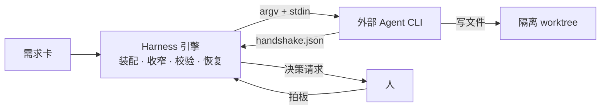
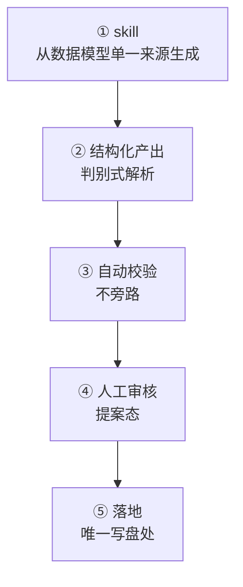
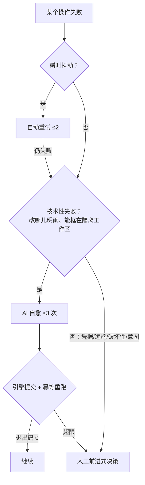

# 我如何为 AI 编程工具做了一层 Harness——以及为什么最后停了

> **这是一份文章素材，不是成稿。** 结构、论点、代码片段、图和数据都已备齐，改写成文章时可按目标平台裁剪：
> 每一节都标了「可删」的部分，删掉不影响主线。全文按「问题 → 设计 → 取舍 → 代码 → 遗留」的固定节奏写，
> 取舍表是这篇文章的核心竞争力——**光讲设计没意思，讲清楚当时否掉了什么才有价值**。
>
> 素材来源：[`docs/project-goals.md`](./project-goals.md)、[`docs/agent-skill-rail.md`](./agent-skill-rail.md)、
> [`docs/failure-handling.md`](./failure-handling.md)、`openspec/specs/`（51 份）、`openspec/changes/archive/`（58 个）。

---

## 开头：一句话把读者钉住

可选的三个开头，挑一个：

1. **从症状切入**：「AI 写代码很快。项目小的时候，快就是全部。项目大起来之后，你会发现真正的瓶颈不是它写得多快，而是它每写一次，你要花多久才能确认它没把别的东西弄坏。」
2. **从结论切入**：「我花了两个月给 AI 编程工具做了一层 Harness，然后停了。停的原因不是它不 work——它 work——而是我发现自己在造一个别人已经造好的东西的下半截。」
3. **从数字切入**：「31,300 行实现、25,100 行测试、51 份规格、58 个变更提案，两个月，一个人。最后归档。这篇讲这套东西是怎么设计的，以及为什么该停。」

推荐 1（症状最有共鸣），把 2 的后半句放在文末呼应。

---

## 一、为什么需要一层 Harness

### 症状：腐烂不是从代码开始的

直接让 AI 在一个项目上持续写代码，前二十次都很好。问题从某一次开始：它照着一份**已经过时的文档**改了一个模块。

这一改之后，代码和文档的距离又拉大一点，下一轮 AI 读到的上下文更歪一点。**错误开始复利。** 等你注意到的时候，症状表现为「AI 最近变笨了」，但根因不在模型，在于**没有任何东西在维护「文档说的」和「代码做的」之间的一致性**。

同一个模式在别的地方重复出现：

- **上下文腐烂**：你把整个仓库丢给它，它读了 80% 的无关文件，剩下的预算不够读关键的那几个。
- **权限腐烂**：一次「帮我看看这个需求进展如何」的咨询，它顺手改了三个文件。
- **状态腐烂**：跑到一半崩了，你不知道它做完了哪些、没做哪些，只能从头再来。
- **失败腐烂**：合并冲突了，它说「我已经解决了」，实际上把另一个人的改动整段删了。

> 可删：上面四条可以只留两条，挑「权限」和「失败」——最有画面感。

### Harness 是什么

**Harness 不是让 AI 更聪明，是让 AI 的不可靠变得可管理。** 具体是四件事：

| Harness 管的事 | 不管会怎样 |
|---|---|
| 上下文怎么装配 | AI 读了一堆无关文件，关键信息挤不进窗口 |
| 权限怎么收窄 | 一次只读咨询把代码改了 |
| 产出怎么验 | AI 说做完了，实际没有；没人发现 |
| 失败怎么恢复 | 崩一次就得从头来 |

Klarit 的定位就落在这一层：**它自己不写代码，不自建模型通道。** 写代码是 Claude Code / Codex / Cursor 的活，Klarit 管它们上面那一层。



---

## 二、三层 Agent：按「能看多大、能不能写」切

### 问题

一开始我只有一个 agent，什么都干：回答用户问题、拆需求、写代码。很快就撞上一个具体的坑——**用户问「这个需求做到哪了」，agent 顺手改了文件**。

它没做错什么，它只是有写权限，而它认为改一下更有帮助。

### 设计

按**可见范围**和**写权限**切成三层，从外到内收窄：

| 层 | 权限 | 可见范围 | 干预能力 |
|---|---|---|---|
| 全局 Agent | **只读** | 项目目标、所有卡、所有分支/worktree | 可叫停/调度任意后台 Agent |
| 单需求 Agent | **只读** | 本卡资料 + 本卡在各成员仓的分支 | 只能管自己那张卡 |
| 后台执行 Agent | 引擎按需授予**读写** | 引擎指定的一条工作分支 | 自身即执行者 |

三条不变量：

1. **只有最内层能写。** 上面两层是只读的，所以任何一次咨询都不可能误伤代码。
2. **可见范围逐层收窄。** 越靠近代码，暴露面越小。
3. **Agent 之间永不直连。** 引擎是唯一总线——全局 Agent 想干预后台 Agent，是向引擎发指令、引擎再去操作目标进程。

### 取舍

| 选了什么 | 另一个选项 | 为什么否掉 |
|---|---|---|
| 按权限分三层，只读层与读写层物理分离 | 一个 agent 全干，靠 prompt 里写「不要改文件」 | prompt 是**建议**不是**约束**。模型有 1% 的概率不听，而在一个跑几百次的系统里，1% 就是必然发生 |
| 引擎当唯一总线，agent 间不直连 | agent 之间直接传消息（多 agent 协作框架的常见做法） | 直连之后「谁改了什么」不可追。总线让每一次干预都留在一个地方，排查时只看一条时间线 |
| 干预自上而下（全局能叫停后台，反之不行） | 对等，谁都能叫停谁 | 对等结构里两个 agent 可以互相叫停，形成活锁。单向指挥链没有这个问题 |

### 遗留（诚实部分）

- 单需求 Agent 的「退回指定节点」和内容驱动回退是两套入口，语义有重叠，没合并。
- 「AI 托管模式」（全局 Agent 代替用户拍板）实现了，但我自己不敢开——因为下面第四节的自愈上限没有调优依据，托管等于把一个没标定的参数交给它。

---

## 三、产出轨道：为什么要卡这五道

### 问题

全局 Agent 有四项能力：编排需求卡、分解大需求、写工作流、提议建项目。第一版我是**一项一套产出逻辑**写的。写到第三项的时候出现了一个我没预料到的 bug 类型：

**AI 产出的工作流总是校验不过，但 AI 没错。** 根因是我改了校验规则（加了分支配对检查），但驱动它的那段 skill 文本是**手写的**，还停在旧规则上。AI 老老实实按 skill 产出，校验器老老实实按新规则拒绝。

这不是 AI 的问题，是**我有两份会漂移的真相**。

### 设计

把四项能力全部收到同一条轨道上。加新能力＝往轨道上加一个骑手，不是另起一套。



五道各卡什么：

1. **skill 从单一来源生成**——`buildDecomposeSkill(types)` 从卡类型注册表生成，`buildAuthorWorkflowSkill()` 从引擎操作集与校验约束生成。改了校验规则，skill 自动跟着变。**这一道直接消灭了上面那个 bug 类型。**
2. **结构化产出**——agent 回复经判别式解析器收敛成带类型的产出。一次调用内 agent 自己路由到「自由聊天 / 产 A / 产 B」，纯聊天是有效轮次、不算失败。
3. **校验不旁路**——不合法的**不静默回落、不当合法用**。要么进 issues 让人审，要么让 agent 修好再报，半成品不丢。
4. **人工审核**——产出停在提案态，确认前不落盘。
5. **落地**——每种管理态只有一个写入口。

### 取舍

| 选了什么 | 另一个选项 | 为什么否掉 |
|---|---|---|
| skill 从数据模型生成 | 手写 skill，靠人记得同步 | 已经被现实否掉了——这就是那个 bug 的根因。人不会记得 |
| 一次调用内 agent 自路由 | 先跑一次「意图分类」再跑对应能力 | 两次调用，一倍延迟一倍成本，而且分类器自己会错。让 agent 在一个 prompt 里自己选，聊天也算有效轮次 |
| 校验失败进 issues 或让 agent 修好再报 | 校验失败就丢弃、让用户重说一遍 | 丢弃等于把半成品的价值归零。用户重说一遍**大概率还是同样的产出** |
| 一律停在提案态、人确认才落盘 | 自动落盘 + 提供撤销 | 撤销是**事后**的，而卡库落盘会连带建分支、开 worktree。撤销一个已经建了 5 条分支的操作，比一开始就不建难得多 |

### 红线（可直接引用）

每个骑手都得守：只读、绝不碰代码与 git；只提案、人确认后才落地；限当前项目、不跨项目；skill 从单一来源来；校验不旁路；一次调用完成自路由。

---

## 四、失败处置：这一节是全文重点

### 原则

**任何操作结果都不许停在看不见、没有出路的死结。**

四个归宿，顺序是**先自动、再 AI、最后才打扰人**：



分界线定得很死：**技术性失败**（能靠改代码或解冲突消解、且「改哪儿」明确、能框在一个隔离工作区里）→ AI 自愈。**环境/凭据/意图/破坏性失败**（AI 决定不了、也修不了）→ 直接人工。

### 设计取舍 1：合并冲突不在主线上解

**直觉做法**：主线合不进来，那就在主线上叫 AI 解冲突。

**否掉的理由**：那意味着 AI 在所有人的主线上动手。搞砸了很难干净回退——你得知道它改之前主线是什么样，而主线是共享的，别人可能同时在推。

**实际做法是反过来的**：冲突的本质是「卡分支的改动」和「主线的改动」撞在同一处。那就在卡**本来就隔离**的 worktree 里 `git merge <主线>`，**保留冲突态不 abort**，让冲突显现在卡这边；AI 就地解；解完卡分支已经消化了主线，**再合回主线就是干净快进**。

主线全程没被碰过。AI 搞砸了，大不了把卡分支重置回动手前。多仓时逐仓各走一遍、各自独立。

> **这是全文最值得单独讲的一个点。** 它是一个「把问题搬到一个你能承受失败的地方再解决」的通用模式，
> 不只适用于 git——任何「AI 要在共享资源上动手」的场景都能套。

### 设计取舍 2：heal agent 只改不提交

**问题**：怎么知道 AI 真的修好了？

**否掉的选项**：问它。它会说修好了。这不是它撒谎，是它没有能力可靠地验证自己——它没跑那条命令。

**实际做法**：收敛判据是**客观事实**。AI 改完就退出（**不提交**），引擎确定性提交范围内改动，再把那条失败的命令 / 那道门**原样重跑一遍**，看退出码。

```ts
// src/main/engine/engine.ts —— healCommand 的收敛循环（节选）
while ((hr.attempts ?? 0) < MAX_HEAL) {
  const prep = prepareHealAgent(bp, { kind: 'command-failure', /* … */ })
  const res = await spawnHealAgent(bp, node.id, hr, prep, wt, hsDir, hsFile, a)
  // …

  // 引擎确定性提交范围内改动（整树可写）。
  await scopeGuard({ worktree: wt, read: wread, write: wrun, startSha, /* … */ })

  if (await opts.verify()) {          // ← 把失败的命令原样重跑一遍
    hr.attempts = 0
    return 'resolved'
  }

  // 失败原因取 agent 输出尾部——能暴露「连不上 API」这类真因，而不是笼统的「没修好」
  const cmdAgentTail = outputBuffer.read(bp.runId, `node:${node.id}`).trim().slice(-400)
  hr.lastFailure = cmdAgentTail ? `AI 修复后命令仍未通过（AI 可能运行出错）。它的最近输出：\n${cmdAgentTail}` : /* … */
  hr.attempts = (hr.attempts ?? 0) + 1
}
```

**「修好了」不是 AI 的自我报告，而是幂等重跑的结果。** 这句可以当小标题。

顺带一个细节：失败原因取的是 **agent 输出的尾部**，不是笼统的「修复失败」。因为最常见的失败根本不是「没修对」，是「agent 连不上 API」——两者的处置完全不同，而只有输出尾部能区分它们。

### 设计取舍 3：门驳回走内容驱动回退，且回退是「重入」不是「重置」

**场景**：人工评审门，用户看了产出说「这里体验不对」。

**否掉的选项 A**：让用户指定退回哪个节点。用户不知道。他看到的是最终产出，问题可能是三个节点之前的规划就错了。

**否掉的选项 B**：回退 = 重置到目标节点的起始态、下游全部作废重生。语义干净，但代价极大——下游可能已经建了分支、开了 worktree、跑过测试、开了 PR，全作废意味着这些全部重来，而其中大部分和驳回意见毫无关系。

**实际做法**：

1. 用户只在自由输入框写不满意的点（**不另设「驳回」按钮**——框空时提交禁用，天然保证「驳回必带理由」，因为判定 agent 需要理由才能判）。
2. 引擎拉起一个**只读**判定 agent：解析反馈 → 命中的产物集合 → 经产物溯源图反查生产节点 → 定位覆盖它们的**最早**节点（主选 + 备选）→ 交用户确认。
3. 回退后**不 git reset、不撤下游代码、不作废下游产出**。把「你之前已推进到节点 N、驳回意见是什么、请在现有进展上修复」注入目标节点执行者，工作流带着修复**前向重流**回评审门复审。沿途已建的分支/worktree 由幂等引擎操作复用。

**判定 agent 只读，真正的修复由被退回节点的执行者（有写）去干。** 判断和执行分开，是三层结构在失败路径上的自然延伸。

**产物溯源图是派生视图，不是新存储**——加一份独立存储就多一处会漂移的真相（又是第三节那条教训）：

```ts
// src/main/engine/lineage.ts —— 纯函数，git 访问经 diffNames 注入
export function deriveLineage(bp: RunBreakpoint, nodes: WorkflowNode[], diffNames: DiffNames): LineageEntry[] {
  const entries: LineageEntry[] = []
  for (const node of nodes) {
    const declared = (node.outputs ?? []).map((o) => o.destination.path).filter((p) => !!p)
    const code = new Set<string>()
    const run = bp.agentRuns?.[node.id]
    if (run?.startSha && run.commitSha) {
      for (const memberId of Object.keys(run.commitSha)) {
        // 代码这类隐式产出：按每个 agent 节点的 startSha..commitSha 改动文件归节点
        for (const f of diffNames(memberId, run.startSha[memberId], run.commitSha[memberId])) code.add(f)
      }
    }
    if (declared.length || code.size) entries.push({ nodeId: node.id, declared, code: [...code] })
  }
  return entries
}
```

### 设计取舍 4：什么时候放弃

两个上限：瞬时重试 2 次、AI 自愈 3 次。超限**不静默挂起**。

**「前进式决策」这个概念值得展开讲**：所有决策的每个选项都让流程继续（继续 / 跳过 / 重做 / 换法），破坏性选项标警示，**没有「中止」这类死结选项**。

```ts
// src/main/engine/decisions.ts
// 除人工评审门外，所有决策恒带一个自由输入框（追问/让 AI 帮处理）
input: { labelKey: `${K}.freeInput`, placeholderKey: `${K}.freeInputPlaceholder` }
```

还有一条硬要求：**回落决策的原因里必须写清「AI 已自动尝试几次、最后一次的真实报错是什么」**。否则用户面对的是一个没有上下文的失败，只能选「重试」然后祈祷。

| 选了什么 | 另一个选项 | 为什么否掉 |
|---|---|---|
| 前进式决策，无「中止」选项 | 给「中止」按钮 | 中止之后状态停在哪？分支建了没删、worktree 占着——「中止」制造的是一个需要人手工收拾的烂摊子，不是一个干净的终止 |
| 每个决策恒带自由输入框 | 只给固定选项 | 固定选项永远枚举不全。自由输入框是**转交 AI 的口子**：用户可以就地追问「这是什么意思」，也可以把处置交给 AI |
| 上限 2 / 3 次 | 无限重试直到成功 | 一个总失败的操作会把并发槽永久占死。有限次 + 转人工，最坏情况是打扰人一次，而不是静默雪崩 |

### 两道内置护栏（可删，但很能体现工程性）

**可写范围越界后置检测**：无头拉第三方 CLI 没法逐路径沙箱化它的写操作，所以是**节点完成时后置检测**：

```ts
// src/main/agent/scope.ts —— 实际可写 = 声明的可写范围 ∪ 所有产出路径
export function classifyScope(changed: string[], writableScope: string[], outputPaths: string[]) {
  const scope = [...writableScope, ...outputPaths].map((s) => s.trim()).filter((s) => s !== '')
  const wholeBranch = writableScope.filter((s) => s.trim() !== '').length === 0
  const inScope: string[] = [], outOfScope: string[] = []
  for (const file of changed) {
    const ok = wholeBranch || scope.some((s) => within(file, s))
    ;(ok ? inScope : outOfScope).push(file)
  }
  return { inScope, outOfScope }
}
```

越界文件**确定性还原**到节点起始基线，范围内改动保留并提交。**超限抛决策时，选项必含「放宽可写范围」**——越界最常见的原因是范围声明太窄（改代码必然要动 import 它的文件），缺这个选项会让「硬撤 + 硬返工」陷入死循环。

> 这个细节值得写进文章：**一个自愈循环，必须有一条「承认约束本身错了」的出路。** 否则它会忠实地、
> 反复地、正确地失败下去。

---

## 五、编排外部 Agent：三个关键决定

> 可删整节（如果篇幅紧张）。但「握手缺失即乐观 done」那条很有意思，值得至少留一段。

**① 声明式 adapter，不写裸启动命令。** 工作流是拿来分享和复用的**数据**；裸命令会把某台机器的 CLI 路径和环境绑死进去。节点只声明 `{工具 id, 模型, 额外参数}`，adapter 是**纯函数，只做 argv 翻译**。

**② prompt 走 stdin，且是确定性拼装的。** 固定层序：`# 回复语言 → # 宪法 → # 任务 → # 需求卡 → # 涉及的成员仓 → # 可写范围 → # 产出 → # 引擎交互协议`。同一个函数同时供执行期和「UI 里预览完整 prompt」——差异只来自输入，不来自拼装规则。

**③ 成败判定走握手文件，不解析 stdout。** stdout 只用于展示进度。结构化控制状态的唯一真相源是 agent 写到引擎指定绝对路径的 `handshake.json`。

**握手缺失即乐观 `done`** ——这是一个刻意的宽容点：

```ts
// src/main/agent/handshake.ts
/** 纯解析：把握手文件原文（或 null）收敛为 AgentHandshake；任何异常/未知 status 归乐观 done。 */
export function parseHandshake(raw: string | null): AgentHandshake {
  if (!raw || !raw.trim()) return DONE
  try { obj = JSON.parse(raw) } catch { return DONE }
  // …未知 status 一律归 done
}
```

**取舍**：第三方 CLI 不会完美遵守协议。选项 A 是严格判定——没写握手就算失败，但那会让大量正常完成的运行被判失败。选项 B 是乐观 done——**协议的严格性由下游的客观验证保证（客观门 + 越界检测），而不是靠上游的合规假设**。选了 B。

**安全边界**（`launch.ts` 是**唯一**启动实现）：以探测出的可执行**绝对路径**启动，绝不把裸命令名交给 shell——子进程的 cwd 是需求卡 worktree，内容可能来自导入的第三方项目，而 Windows 的命令解析**先搜当前目录**，交裸名等于让被管理的仓库决定起哪个可执行文件。argv 也绝不经 shell 字符串拼接：Node 在 `shell: true` 下把 command 和 args 用空格 join 且不加引号，那正是注入面的根因。

---

## 六、规格驱动怎么防腐

回到第一节那个症状：**腐烂从「文档说的」和「代码做的」不一致开始。**

约束很简单：

- **`openspec/specs/` 是单一真相源**——51 份能力规格，每份用 `Requirement` + `Scenario`（WHEN/THEN）写清行为，**不是散文式文档**。
- **`openspec/changes/` 是变更提案**——每个含 `proposal.md`（为什么）、`design.md`（怎么设计、**否掉了什么**）、`tasks.md`（逐条可勾选）、`specs/` 下的 **delta**（这次对哪些能力增删改了哪几条）。做完归档、delta 合进主 specs。仓库里 58 个已归档变更。
- **动态文档只记最新现状**：不留旧版、不写与旧版差异。过时就直接改或删。
- **顺序固定为「先改 spec → 写红测试 → 再实现」**，不是实现完补文档。

**关键在于**：规格里每条 Scenario 都能直接对应一个测试用例。这让「文档过时」这件事**变得可检测**——spec 和测试对不上就是红的。

| 选了什么 | 另一个选项 | 为什么否掉 |
|---|---|---|
| Requirement + Scenario 的结构化规格 | 散文式设计文档 | 散文没法对应到测试。「文档过时」在散文里是不可检测的 |
| 先改 spec → 红测试 → 实现 | 实现完补文档 | 补的文档描述的是「我实现成什么样」，不是「应该是什么样」。这两者的差别正是下一轮 AI 会踩的坑 |
| 动态文档只记现状，过时就删 | 保留版本历史、写 changelog | 版本历史让文档越长越难读，而 AI 读的是全文。「与旧版的差异」对当前决策毫无用处 |
| 变更提案要写 `design.md`（含否掉的方案） | 只写 tasks | 半年后回看，「为什么不那样做」比「做了什么」有用得多。这份文章素材本身就是从 58 个 design.md 里长出来的 |

**这套东西的复利**：写这篇文章时我发现，因为每个变更都留了 design.md，我几乎不需要回忆——每个取舍当时的备选方案和否掉理由都在仓库里。**规格驱动的收益不只是防腐，还包括让「过去的自己」变成一个可查询的对象。**

---

## 七、为什么停

开发中途发现了一个成熟竞品，它已经把**执行层**（Agent 编排与并发执行）做到了相当完整的程度。

判断链条：

1. **执行层正面打没有胜算。** 对方在这一层的投入和完成度远超一个人的项目。
2. **我的差异化只可能在需求层**——需求的拆分/合并、卡与卡的关系图、规格驱动的防腐。但需求层单独拿出来**不构成一个产品**，它必须依附在一个足够好的执行层上。
3. **「站在它上面做需求层」这条最省力的路走不通**——它的许可证禁止商业嵌入，代码也不能借鉴。
4. 剩下的唯一选项是「自己把执行层也做到同等完成度」。那是我不打算投的量级。
5. **结论：止损。**

**这不是一次失败，是一次有明确结论的产品验证。** 技术假设验证通过了：

- 三层 Agent 的权限模型跑得通。
- heal 机制在真实的合并冲突和测试失败上确实能自己收敛。
- 断点恢复在关软件重开后能接上。

产品假设被证伪了：这套东西不构成一个值得继续投入的独立产品。**假设被证伪就停，是这次决策里我唯一想强调的部分。** 更常见的失败模式不是判断错，是判断对了但舍不得停。

> 文章结尾可以呼应开头：「AI 写代码很快。但决定一个项目能不能长大的，从来不是写得多快。」

---

## 八、没做完的、以及没验证的假设

**这一节不要删。** 一篇只讲成功的技术文章可信度是零。

**设计上只做了一半：**

- `subworkflow` 执行者**只有定义没有实现**。四类执行者里 `agent`/`engine`/`command` 都落地了，`subworkflow`（含环检测 + 深度上限 + I/O 映射）停在数据模型层，运行时直接跳过。
- **adapter 只有 Claude Code 走通了完整链路。** Codex 和 Cursor 的 adapter 写完了（argv 翻译 + 续接形态），但没在真实项目上跑通全流程，尤其是续接语义和握手协议的遵守程度。
- **外部门只支持 `pr-merged` 一种**，「再核查」靠用户点按钮。判定被刻意设计成「核查外部状态」而非「用户断言」，就是为了将来接 webhook——但 webhook 没接。
- **产物溯源图只覆盖 agent 代码产物 + 声明式产出。** command 节点的隐式产物没入图，所以内容驱动回退在「问题出在某个 command 节点」时定位不到它。
- **Klarit 自己的 skill 没装进用户 CLI。** 设计上应当作为「已装技能」按名字调用（prompt 更瘦、用户可见可改），现状是每轮内联。回落路径写好了，主路径没做。

**没验证的假设（更重要）：**

- **`heal` 的 3 次上限没有调优依据。** 它在我遇到的冲突和测试失败上够用，但我**从没统计过「第几次收敛」的分布**，不知道 3 是偏保守还是偏激进。一个没标定的参数，却是整个自愈机制的核心阈值。
- **上下文装配的成本没有度量。** `habit-context` 那次优化（把整个成员仓挂给 author 改成逐字物化一个小上下文包）是因为 author 在大项目上慢到不可用才做的，**但改完之后没有测量收益**——只知道能跑，不知道快了多少。这是这个项目里我最不满意的一处：一次性能优化没有前后对比数据。
- **只在单机、单人、小规模项目上 dogfood 过。** 多仓最多验到 2 个成员仓；没验证过几十张卡同时在跑、或一个仓有几十条 worktree 时的表现。
- **并发上限是个拍脑袋的数。** 自动排程和定时巡检共享一个并发槽，槽满就跳过不排队——这个策略在真实负载下对不对，没有数据。
- **崩溃恢复只在人为杀进程的场景下验过。** 真实的进程崩溃、磁盘写到一半、worktree 被外部工具改动，没有系统性测过。

> 可以把「heal 3 次没标定」和「性能优化没测收益」放在一起写一段：**这套系统里所有确定性的部分我都测了
> （25,100 行测试），所有需要经验数据标定的部分我都没测——因为标定需要规模，而我停在了规模之前。**
> 这句话既诚实，又准确地划出了单人项目的能力边界。

---

## 附：可复用的数据与金句

**数据**（写文章时可直接引用）：

| 项 | 数字 |
|---|---|
| 实现代码 | ~31,300 行 |
| 测试代码 | ~25,100 行（141 个测试文件） |
| 能力规格 | 51 份 |
| 已归档变更提案 | 58 个 |
| 开发周期 | 2026-06-17 → 2026-08-11，一个人 |
| 落地的 agent adapter | 3 家（Claude Code 走通全链路） |
| 自愈上限 | 瞬时 2 次 / AI 自愈 3 次 |

**金句候选**：

- 「Harness 不是让 AI 更聪明，是让 AI 的不可靠变得可管理。」
- 「prompt 是建议，不是约束。在一个跑几百次的系统里，1% 的不听话就是必然发生。」
- 「『修好了』不是 AI 的自我报告，而是幂等重跑的结果。」
- 「把问题搬到一个你能承受失败的地方，再解决它。」（合并冲突在卡分支上解）
- 「一个自愈循环，必须有一条『承认约束本身错了』的出路。否则它会忠实地、反复地、正确地失败下去。」
- 「协议的严格性由下游的客观验证保证，而不是靠上游的合规假设。」
- 「腐烂不是从代码开始的，是从文档说的和代码做的不一样开始的。」
- 「规格驱动的收益不只是防腐，还包括让『过去的自己』变成一个可查询的对象。」
- 「更常见的失败模式不是判断错，是判断对了但舍不得停。」
